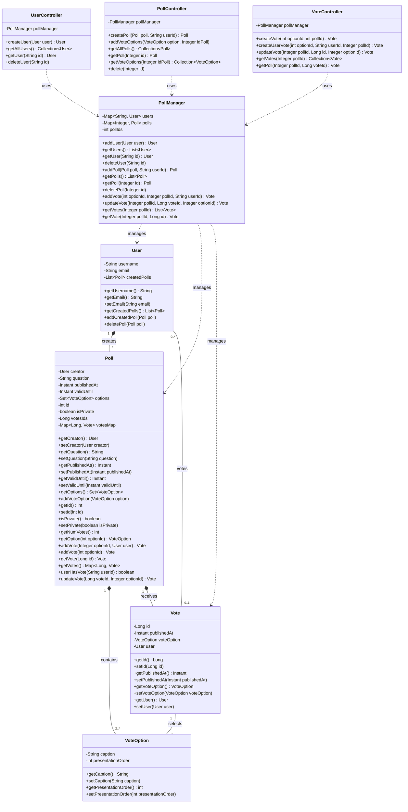

# DAT250: Software Technology Experiment Assignment 2 - Report

## Project Overview
I developed a REST API for a Poll application using Spring Boot as part of the DAT250 course assignment. The application enables users to create polls, add voting options, vote on polls, and manage user accounts through RESTful endpoints. The project follows the domain model specification provided in the assignment description.

**GitHub Repository fot the project**: [https://github.com/Gwen-p/DAT250_expass2](https://github.com/Gwen-p/DAT250_expass2)

## UML diagram

## Technical Implementation

### Domain Model
The application implements a version the domain model in the assignment but with :
- **User**: Users with username (used as an ID) and email who can create polls and vote. 
- **Poll**: Voting polls containing questions, validity period, and voting options.
- **VoteOption**: Individual options within a poll with caption and presentation order.
- **Vote**: Records of user votes with timestamps and user associations.

### REST API Structure
Implemented three main controllers with comprehensive CRUD operations:

- **UserController** (`/users`):
    - `POST /users` - Create new user
    - `GET /users` - List all users
    - `GET /users/{id}` - Get user by username
    - `DELETE /users/{id}` - Delete user

- **PollController** (`/polls`):
    - `POST /polls/{userId}` - Create poll for specific user
    - `GET /polls` - List all polls
    - `GET /polls/{id}` - Get poll by ID
    - `GET /polls/{id}/options` - List poll options
    - `PUT /polls/{id}/option` - Add vote option to poll
    - `DELETE /polls/{id}` - Delete poll

- **VoteController** (`/votes`):
    - `POST /votes/{pollId}/{optionId}` - Anonymous vote
    - `POST /votes/{pollId}/{optionId}/{userId}` - User vote
    - `PUT /votes/{pollId}/{voteId}/{optionId}` - Update vote
    - `GET /votes/{pollId}` - List votes for poll
    - `GET /votes/{pollId}/{voteId}` - Get specific vote

### Business Logic Layer
- **PollManager**: Central service component handling all business logic and in-memory data management
- Manages users, polls, and votes using HashMap collections
- Handles vote validation and business rules

### Testing Strategy
Created comprehensive test coverage:

- **Manual Testing**: Two HTTP test files (`Poll-Manual-Test1.http`, `Poll-Manual-Test2.http`) covering different usage scenarios
- **Automated Testing**: Two JUnit test classes (`PollApplicationTests1`, `PollApplicationTests2`) implementing end-to-end integration tests
- **CI/CD Pipeline**: GitHub Actions workflow for automated testing on push and pull requests

## Technical Problems Encountered

### 1. Initial Project Setup
**Problem**: When creating the Spring Boot project, I initially forgot to include the web dependency, which prevented the application from starting properly.

**Solution**: Added the required dependencies to `build.gradle.kts`:
```kotlin
implementation("org.springframework.boot:spring-boot-starter-web")
testImplementation("org.springframework.boot:spring-boot-starter-test")
```

### 2. Controller Design Decisions
**Problem**: I was initially uncertain about the optimal controller structure and considered creating separate controllers for each entity.

**Solution**: After evaluating the requirements, I consolidated into three main controllers that logically group related functionality, with `PollController` and `VoteController` managing `VoteOption` objects appropriately.

### 3. Domain Model Relationships
**Problem**: Determining the optimal relationships between domain classes required multiple iterations as I refined my understanding of the requirements.

**Solution**: Implemented bidirectional relationships with proper Jackson annotations to prevent serialization issues:
- User ↔ Poll (creation relationship)
- Poll ↔ VoteOption (composition)
- Vote ↔ VoteOption (association)
- Vote ↔ User (optional association for authenticated votes)

### 4. HTTP Method Selection
**Problem**: I was uncertain whether to use PUT or POST for adding new vote options to existing polls.

**Solution**: After researching REST conventions, I chose `PUT /polls/{id}/option` since we're modifying an existing resource (the poll) by adding sub-resources (options).

### 5. Error Response Handling
**Problem**: Different error scenarios required appropriate HTTP status codes and messages.

**Solution**: Implemented consistent error handling using Spring's `ResponseStatusException` with appropriate HTTP status codes:
- `404 NOT_FOUND` for missing resources
- `403 FORBIDDEN` for business rule violations
- Custom error messages for different failure scenarios

### 6. JSON Serialization Issues
**Problem**: Circular references between User and Poll entities caused infinite recursion during JSON serialization, resulting in stack overflow errors.

**Solution**: Used Jackson annotations to handle bidirectional relationships:
```java
@JsonIdentityInfo(generator = ObjectIdGenerators.PropertyGenerator.class, property = "username")
public class User {
    // ...
}

@JsonIdentityReference(alwaysAsId = true)
private User creator;
```

### 7. Testing Infrastructure Problems
**Problem**: Encountered Gradle test executor failures with "Could not complete execution for Gradle Test Executor" errors due to dependency conflicts.

**Solution**: Resolved by letting Spring Boot manage dependency versions automatically and removing explicit version declarations that caused conflicts.

### 8. GitHub Actions CI/CD Setup
**Problem**: Initial CI workflow failures due to multiple issues:
- YAML indentation errors
- Missing test dependencies
- gradlew permission issues
- Incompatible dependency versions

**Solution**:
- Fixed YAML syntax in workflow file
- Added proper test dependency configuration
- Included `chmod +x gradlew` step
- Implemented artifact uploading for test reports
- Let Spring Boot manage dependency versions

## Pending Issues and Limitations

### 1. Private Poll Attribute
The `isPrivate` attribute in Poll class is currently unused. I included it anticipating future requirements for private polls that would need access control, but it's not implemented in this version.

### 2. Vote Validation Logic
The current implementation doesn't fully handle all edge cases:
- No validation based on poll privacy settings
- Limited duplicate vote prevention for anonymous users
- Basic expiration checking but no comprehensive time-based validation

### 3. Error Response Consistency
Error responses could be more standardized across different endpoints. Currently, some error messages are more descriptive than others.

### 4. API Documentation
While the basic functionality works, the API lacks comprehensive documentation. Swagger/OpenAPI integration would improve usability for consumers.

### . Security Considerations
No authentication or authorization is implemented. All operations are available without any security constraints.

## Conclusion

The assignment successfully demonstrates a working REST API for a polling application that meets the specified requirements. The application provides complete CRUD operations for users, polls, and votes through a clean REST interface. The main challenges involved designing appropriate domain relationships, handling JSON serialization complexities, and setting up reliable testing infrastructure.

The project implementation shows understanding of Spring Boot fundamentals, REST API design principles, and testing methodologies. While there are areas for improvement (particularly around error handling, validation, and documentation), the core functionality works correctly and provides a solid foundation for future enhancements.

**Achievements**:
-  Complete REST API implementation
-  Proper domain model with relationships
-  Comprehensive testing coverage
-  CI/CD pipeline with GitHub Actions
-  Proper error handling and status codes
-  JSON serialization with circular reference handling

The experience gained through this assignment has been valuable for understanding real-world API development challenges and solutions in the Spring Boot ecosystem.